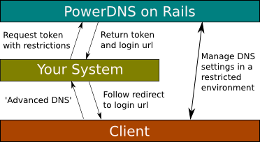

Yesterday I pushed a slew of changes to the <a href="http://github.com/kennethkalmer/powerdns-on-rails/" target="_blank">PowerDNS on Rails repo</a>. The sole focus of the work was to extend the authentication system to have temporary authentication tokens. What are authentication tokens? Allow me to explain&#8230;

**Some background**

Almost all applications these days are expected to provide some kind of REST interface, over and above HTML. It is just part of the whole programmable web paradigm, and makes applications just so much more useful.

PowerDNS on Rails does sport a limited REST interface for adding new domains, and I&#8217;ll extend it over time to provide a full ActiveResource compatible interface to the system. The REST paradigm works great, make no mistake, but in a lot of cases it falls flat&#8230;

**Don&#8217;t re-invent the wheel**

You spend a couple of hours getting PowerDNS on Rails installed and tweaked, you even get new domain additions plugged in via the REST interface. This works great. For some of the bigger clients you provide full access to manage their own domains. They&#8217;re happy, you&#8217;re happy.

For some time this works, but then smaller clients start bothering you with requests for CNAME&#8217;s and other misc A records. Initially it doesn&#8217;t matter much, until they start realizing it takes you a minute to make the changes, so they start requesting more often, and more often, and more&#8230;

Now you sit with some tough decisions&#8230;

*Rebuild PowerDNS into your own app, and leverage a full REST API.*

This makes sense, since most ISP&#8217;s (us included) have some other form of management system that the clients use to add & remove domains. In a lot of cases we completely hide the complexities of the DNS system from the users, they only know about their domains, nothing else.

But why rebuild an already complete interface? Why bother when the open source community will maintain your interfaces for you?

Sold? Thought so, now you might have one option left&#8230;

*Manage users & domain ownerships*

This reinvents another wheel all together. Some folks might argue that PowerDNS on Rails could leverage external authentication mechanisms like LDAP&#8230; I don&#8217;t believe this will solve any problems, I believe it would only make it worse.

And once you start giving people access to the system you have to deal with forgotten password requests, amongst other things. Enabling the forgotten password request functionality for a system that performs core backbone functions is not really an option, the damage done would really hurt domain owners and users dependent on DNS&#8230;

So what is a man to do?

**One possible solution**

So we agreed we&#8217;re not building our own interface on top of PowerDNS on Rails&#8217; existing one, we alse agreed that we&#8217;re not going into the external authentication debate.

So we need a mechanism that will provide the user with pre-defined access to a specific domain so they can do their own updates, without bothering us.

The mechanism should ideally have the following characteristics:

  * Linked to a user that issued the access, gives accountability
  * Linked to a specific domain, prevents snooping around the system
  * Default policy of deny everything
  * Restrict alterations to the RR&#8217;s
      * We host you mail, you can&#8217;t change the MX records
      * We host your site, you can&#8217;t change some A records
      * You cannot alter the SOA or NS records, ever
      * You can add a CNAME, then remove it later
      * Add/remove additional A records that won&#8217;t affect other hosted services
      * Protect RR&#8217;s by type (MX, A, TXT, CNAME, etc&#8230;)
  * Prevent adding RR&#8217;s
  * Prevent removing RR&#8217;s
  * An expiry mechanism, only valid until X
  * [Hook into the audit trails][1]

This is more or less the conversation our support guys would have with a person before they would login for the first time. Why have the conversation when you could restrict their movements completely? Since you provide them with the DNS and other services, its up to specify how they can enhance their naming system, or destroy it totally.

**Enter authentication tokens!**

Currently authentication tokens can only be created via HTTP post, and only by *token_user* role members. The web interface is forth coming. Authentication tokens restrict user movements to a specific domain, and specific RR&#8217;s. They have all the characteristics mentioned earlier, and the interfaces adapt dynamically to show the user only what they can do.

You can now easily hook PowerDNS on Rails into your existing systems by providing users with a &#8216;advanced DNS&#8217; link. User selects, your systems asks PowerDNS on Rails for a token with the said restrictions in place, get a snippet of XML back with contains the token and full URL to the system. Then you just redirect your client to PowerDNS on Rails, et voila.

To get an idea of how to create authentication tokens, look at  *spec/models/auth\_token\_spec.rb* for complete examples. I know documentation is still an issue with the project&#8230;

**And the disclaimers**

In the entire history of the project this has been the first push to a public repo that hasn&#8217;t been battle tested in our production or staging environments. I&#8217;m busy setting up our staging environment for testing, and I&#8217;m sure the users will come up with some issues that will beed addressing.

I wanted to get the code out there for review as well, since I&#8217;m not an expert in application security there might be an issue or two that I&#8217;m not aware off. The code is extensively spec&#8217;ed, and if you don&#8217;t use the tokens the rest of the application still works as espected. A few minor bugs we&#8217;re squashed inadvertedly in the process, and I&#8217;ll update the tracker to reflect this.

**Call for comments!**

Please scrutinize the code, and give feedback. Hopefully the idea and implementation is proven solid and people can extract it for later use in other projects where the DRY principle of tokens really make a difference.

 [1]: /2008/09/25/powerdns-on-rails-now-sports-basic-audits/
