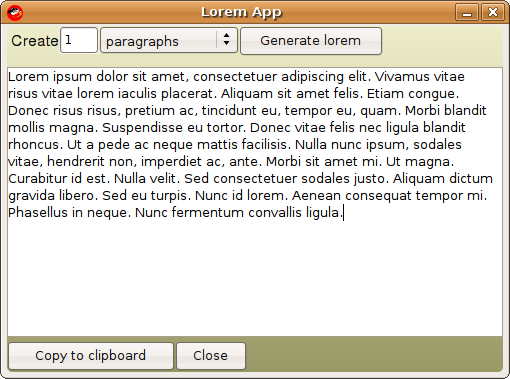

So it&#8217;s been pretty quiet around these parts lately, my apologies. But I&#8217;ve not been keeping quiet on other fronts, I&#8217;ve been busy implementing [ruote][1], by [John Mettraux][2] and contributing some patches back to this amazing project. Looking at my [github profile][3] you&#8217;ll see a lot of things have been happening, and [twitter][4] also has some noise&#8230;

Today though, I thought I&#8217;ll take a break and help [Michelle][5] with some XML and ActionScript issues and in the process we needed some Lorem Ipsum&#8217;s to test big chunks of text. I [remember reading][6] about the [lorem][7] gem (by John Nunemaker) and recently [Shoes&#8217; Raisins release][8], and decided to combine them.

The result, [lorem-app][9], my fitting of shoes. I must admit that the fitting went better than expected. Shoes is brilliant, and this release runs much better than the previous one (at least on my Ubuntu amd64 laptop). It takes a bit used to, but rocks. I can just imagine some really solid apps coming from this little framework as more people adopt it and start contributing back.

Hope you enjoy, and watch this space for some other great things coming in the near future.

 [1]: http://openwferu.rubyforge.org/
 [2]: http://jmettraux.wordpress.com/
 [3]: http://github.com/kennethkalmer
 [4]: http://twitter.com/kennethkalmer
 [5]: http://www.empact.co.za
 [6]: http://railstips.org/2007/4/29/lorem-ispum
 [7]: http://lorem.rubyforge.org
 [8]: http://newwws.shoooes.net/2008/12/06/raisiiiins.html
 [9]: http://github.com/kennethkalmer/lorem-app
